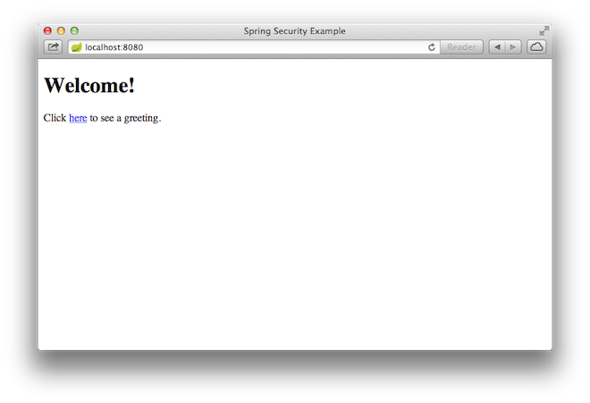

:spring_version: current
:spring_boot_version: 2.2.0.RELEASE
:DispatcherServlet: http://docs.spring.io/spring/docs/{spring_version}/javadoc-api/org/springframework/web/servlet/DispatcherServlet.html
:SpringApplication: http://docs.spring.io/spring-boot/docs/{spring_boot_version}/api/org/springframework/boot/SpringApplication.html
:SpringBootSecurity: http://docs.spring.io/spring-boot/docs/{spring_boot_version}/reference/htmlsingle/#boot-features-security
:toc:
:icons: font
:source-highlighter: prettify
:project_id: gs-securing-web-database

This guide walks you through the process of creating a simple web application with
resources that are protected by Spring Security and getting the user details from a
database rather than use basic auth. This guide uses the completed
https://spring.io/guides/gs/securing-web/[Securing a Web Application] guide as a starting
point. You need not do that guide before doing this guide, but doing so may aid your
understanding of this one.

== What You Will Build

You will build a Spring MVC application that secures the page with a login form that is
backed users that you retrieve from a database.

== What You Need

:java_version: 1.8
include::https://raw.githubusercontent.com/spring-guides/getting-started-macros/master/prereq_editor_jdk_buildtools.adoc[]

include::https://raw.githubusercontent.com/spring-guides/getting-started-macros/master/how_to_complete_this_guide.adoc[]

[[scratch]]
== Starting with Spring Initializr

For all Spring applications, you should start with the https://start.spring.io[Spring
Initializr]. The Initializr offers a fast way to pull in all the dependencies you need for
an application and does a lot of the setup for you. This example needs the Spring Web,
Thymeleaf, and Spring Security dependencies. The following image shows the Initializr set
up for this sample project:

NOTE: The preceding image shows the Initializr with Maven chosen as the build tool. You
can also use Gradle. It also shows values of `com.example` and `securing-web-database` as
the Group and Artifact, respectively. You will use those values throughout the rest of
this sample.

The following listing shows the `pom.xml` file that is created when you choose Maven:

====
[source,xml]
----
include::initial/pom.xml[]
----
====

The following listing shows the `build.gradle` file that is created when you choose Gradle:

====
[source,text]
----
include::initial/build.gradle[]
----
====

[[initial]]
== Converting the Application to Use a Database

The application itself works in the same way. It has the same HTML pages, the same view
controllers defined in `MvcConfig`, and so on. The differences lie in four areas:

* <<setting-up-the-database>>
* <<setting-up-application-properties>>
* <<adding-dependencies-for-the-database>>
* <<changing-the-web-security-configuration>>

[[setting-up-the-database]]
=== Setting up the Database

One of the most common ways to store user data is in a database. It is so common that
Spring Security even has its own database schema with which it can work. You can either
use the Spring Security schema or create a custom one. This example uses a MySQL database.
Spring Security supports many databases, and you can write custom classes to support
pretty much any database.

For the sake of simplicity, use the Spring Security schema in this example. To match the
Spring Security schema, you can use the following SQL statements in MySQL's command line
to create the tables you need:

====
[source,sql]
----
create table users(
	username varchar(50) not null primary key,
	password varchar(100) not null,
	enabled boolean not null
);
create table authorities (
	username varchar(50) not null,
	authority varchar(50) not null,
	constraint fk_authorities_users foreign key(username) references users(username)
);
----
====

You also need an index, which you can create with the following command:

====
[source,sql]
----
create unique index ix_auth_username on authorities (username,authority);
----
====

From there, you can create your user record and set up its authority, as follows:

====
[source,sql]
----
insert into users(username,password,enabled) values('user','$2a$10$FShxdbQCgfQK/4D5r5siFe8Fx/MJesnji49Tttgk.4ax52mEwNS8y',true);
insert into authorities(username,authority)  values('user','ROLE_USER');
----
====

What is going on with that password? That string is the password the password (which is
`password`, as it was in the basic auth example) after it has been encrypted with bcrypt.
The user types `password`, and `BCryptPasswordEncoder` turns it into that string for you
so that it matches the value in the database. You can see how that works a bit later in
this section.

How can you get that string? The following simple program converts the string, `password`,
into a bcrypt value:

====
[source,java]
----
package security.utilities.passwordencoder;

import org.springframework.security.crypto.bcrypt.BCryptPasswordEncoder;

public class PasswordEncoder {

	public static void main(String[] args) {
		String encodedpassword=new BCryptPasswordEncoder().encode("password");
		System.out.println(encodedpassword);
	}

}
----
====

[[setting-up-application-properties]]
=== Setting up Application Properties

To get your database to work, you need to set some values in the `application properties`
file (in the `resources` directory of our application).
The following listing shows those values:

====
[source]
----
spring.datasource.driver-class-name=com.mysql.jdbc.Driver
spring.datasource.url=jdbc:mysql://localhost:3306/security?useSSL=false
spring.datasource.username=root
spring.datasource.password=password
----
====

CAUTION: Do NOT set your username to `root` and your password to `password` for a real
application. We did it here because this is an example.

[[adding-dependencies-for-the-database]]
=== Adding Dependencies for the Database

To get the application to work, you have to add two dependencies: a MySQL connection and
Spring Data JDBC. The following listing shows the new `pom.xml` file:

include::complete/pom.xml[]

The following listing shows the new `build.gradle` file:

include::complete/build.gradle[]

[[changing-the-web-security-configuration]]
=== Changing the Web Security Configuration

You also need to make substantial changes to your `WebSecurityConfig` class. In
particular, you can remove the `UserDetailsService` bean, and you need to add a
`configure` method that uses `AuthenticationManagerBuilder` as a parameter. You also need
to define a data source (which finds your database). Note that the `configure` method is
an override of the same method in `WebSecurityConfigurerAdapter`. The following listing
shows your new `WebSecurityConfig` class:

====
[source,java]
----
package com.example.securingweb;

import javax.sql.DataSource;

import org.springframework.beans.factory.annotation.Autowired;
import org.springframework.context.annotation.Configuration;
import org.springframework.security.config.annotation.authentication.builders.AuthenticationManagerBuilder;
import org.springframework.security.config.annotation.web.builders.HttpSecurity;
import org.springframework.security.config.annotation.web.configuration.EnableWebSecurity;
import org.springframework.security.config.annotation.web.configuration.WebSecurityConfigurerAdapter;
import org.springframework.security.crypto.bcrypt.BCryptPasswordEncoder;

@Configuration
@EnableWebSecurity
public class WebSecurityConfig extends WebSecurityConfigurerAdapter {

	@Autowired
	private DataSource dataSource; <1>

    @Override
    protected void configure(HttpSecurity http) throws Exception {

        http
            .authorizeRequests()
                .antMatchers("/", "/home").permitAll()
                .anyRequest().authenticated()
                .and()
            .formLogin()
                .loginPage("/login")
                .permitAll()
                .and()
            .logout()
                .permitAll();
    }

    @Override
    protected void configure(AuthenticationManagerBuilder auth) throws Exception { <2>

      auth.jdbcAuthentication().dataSource(dataSource)
          .usersByUsernameQuery("select username, password, enabled"
              + " from users where username=?")
          .authoritiesByUsernameQuery("select username, authority "
              + "from authorities where username=?")
          .passwordEncoder(new BCryptPasswordEncoder());
    }

}
----
<1> Autowire the data source.
<2> The `configure` method that has `AuthenticationManagerBuilder` as a parameter.
====

You can rely on Spring Boot to find our database (from the information in
`application.properties`), so you need only autowire it here to get it to work.

What does that `configure(AuthenticationManagerBuilder auth)` method do?
The `AuthenticationManagerBuilder` exposes a method called `jdbcAuthentication`, which
supports chaining other methods to define the user query that you use to see if a user
matches the user name and password provided in the HTML form. The `jdbcAuthentication`
method lets you specify the data source and then add two queries, one for the user and one
for the authority. It also lets you specify the password encoder.
Since you specify `BCryptPasswordEncoder`, the password provided by the user in the form
matches the bcrypt-encoded password that we inserted into the database earlier, so long as
the user types `password`.

Why do you not need `UserDetailsService`? The `jdbcAuthentication` method provides a
`JdbcUserDetailsManagerConfigurer` object, which does the same thing as
`UserDetailsService` and lets us connect to a database. Really,
`AuthenticationManagerBuilder.jdbcAuthentication` is the heart of this example.

[[run_the_app]]
== Run the Application

The Spring Initializr creates an application class for you. In this case, you need not
modify the class. The following listing (from
`src/main/java/com/example/securingweb/SecuringWebDatabaseApplication.java`) shows the
application class:

====
[source,java]
----
include::complete/src/main/java/com/example/securingweb/SecuringWebDatabaseApplication.java[]
----
====

include::https://raw.githubusercontent.com/spring-guides/getting-started-macros/master/spring-boot-application.adoc-new-path[]

include::https://raw.githubusercontent.com/spring-guides/getting-started-macros/master/build_an_executable_jar_subhead.adoc[]
include::https://raw.githubusercontent.com/spring-guides/getting-started-macros/master/build_an_executable_jar_with_both.adoc[]

Once the application starts up, point your browser to `http://localhost:8080`. You should
see the home page, as the following image shows:

When you click on the link, it attempts to take you to the greeting page at `/hello`.
However, because that page is secured and you have not yet logged in, it takes you to the
login page, as the following image shows:

image::images/login.png[The login page]

NOTE: If you jumped down here with the unsecured version, you do not see the login page.
You should back up and write the rest of the security-based code.

At the login page, sign in as the test user by entering `user` and `password` for the
username and password fields, respectively. Once you submit the login form, you are
authenticated and then taken to the greeting page, as the following image shows:

image::images/greeting.png[The secured greeting page]

If you click on the *Sign Out* button, your authentication is revoked, and you are
returned to the login page with a message indicating that you are logged out.

== Summary
Congratulations! You have developed a simple web application that is secured with Spring
Security and that gets its user details from a database.

== See Also

The following guides may also be helpful:

* https://spring.io/guides/gs/securing-web/[Securing a Web Application]
* https://spring.io/guides/gs/spring-boot/[Building an Application with Spring Boot]
* https://spring.io/guides/gs/serving-web-content/[Serving Web Content with Spring MVC]
* https://spring.io/guides/topicals/spring-security-architecture/[Spring Security Architecture] (Reference guide)
* https://spring.io/guides/tutorials/spring-security-and-angular-js/[Spring Security and Angular JS] (Tutorial)

include::https://raw.githubusercontent.com/spring-guides/getting-started-macros/master/footer.adoc[]
